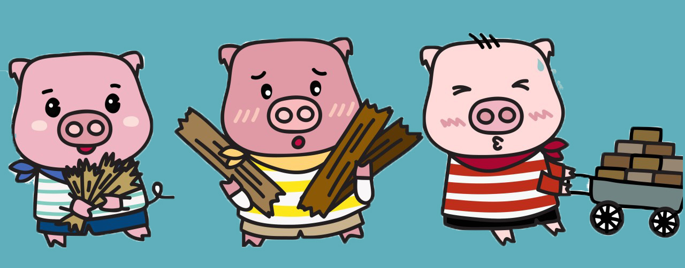

### DM-UY 1143 Ideation and Prototyping

# Three Little Pigs

<image src="../Images/3PigsHomes.jpg" style="width:50%"/>

## Group Exercise to Identify low, medium & high project risks

Within your group, introduce your project with a short elevator pitch. Present the current standing of your Moodboard while talking. Let your group members ask you questions regarding your project. Such as:

	- Have you thought about...?

	- Tell me more about.....?

	- Does this relate to.....?

	- Are you thinking about......?

After a short discussion, group members then write feedback on the post-it notes, for straw, sticks and stone, with reference to aspects of your project that are strong, weak, and inbetween. Underneath each rating, they will give you feedback & ideas.

# __Made of Straw__ (yellow)   |    __Made of Sticks__ (green)   |   __Made of Stone__ (blue)

  # High Risk | Weak or could fall apart.|
 # Medium Risk         |     Somewhat rigid. |
 # Low Risk       |     Immovable. Low Risk 

Afterwards, use this feedback to help your project onto more solid grounds. Create How Might We statements to identify next steps. Post these statements and a general reflection regarding the feedback process on your site, under "Reflections"